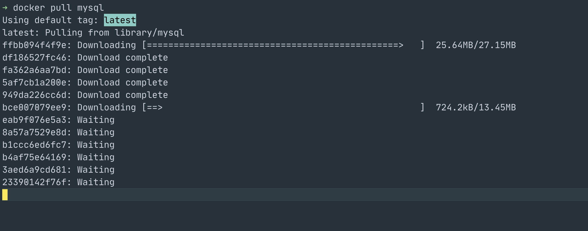
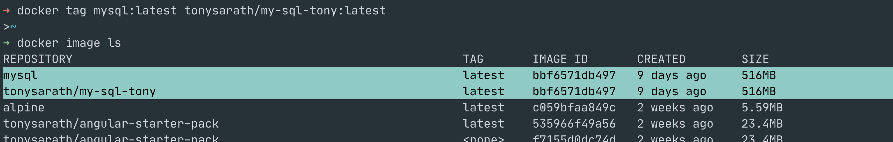
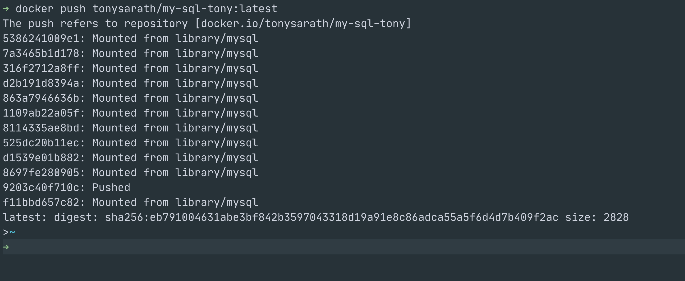

# `</>` Docker for Developers `</>`;

#### WORKSHOP # 02;
#### Date: 2021-12-12;
#### Time: 10:00 - 16:00;
#### Location: Microsoft Teams;

---

## Why do you need docker?

- OS compatibility
- Library/dependency compatibility
- The Matrix from Hell!!
- New developer joiner, setup environment
- Ensure all developers are on same env
- Run each component in a separate container with its own dependencies and libraries
- Build Once, Use Many by developers
- Docker (high level) utilizes Aleksey (low level) containers
- Sharing the kernel
- Ship, run anywhere, anytime, many times
- Efficiency than VM
- Easy recovery
- Enabler of DevOps

## Prerequisite 

- to follow along this workshop you need to have docker engine ready running in your system
- I recommend to use Linux native system ether your local system or AWS EC2 Linux, to experience 100% of docker features
- If you are using Docker Desktop on Windows/MacOSX, it will be not native, instead the Docker Desktop will spine up VM on top of your OS
- verify your docker engine ready by `version` command

```shell
docker version
```

output:


## Practise Commands and capture screen:

- run : start a container

```shell
docker run $image_name # attach mode, CTRL+C to stop, container will also exit
```


```shell
docker run -d $image_name # detach mode
```


```shell
docker run -i $image_name # interactive mode
```


```shell
docker run -it $image_name # interactive sudo terminal mode
```


```shell
docker run -p $external_port:$internal_port $image_name # mapping port 8080 of localhost to port 80 of container, we can't now access nginx through port 80, but instead need to use 8080.
```


```shell
docker run -v $docker_host_dir:$container_dir $image_name # persistent data store
```


for Docker Desktop in Windows/MacOSX will need to search for work around on docker volume.

- attach : attach terminal into running container

```shell
docker attach $container_name
docker attach $container_id
```


when we attach without interactive mode, the container will stop if we do `CTRL+C`
but if just close our terminal window, will not impact to attached console, so container still running.

- ps : list containers

```shell
docker ps # show only running containers
```


```shell
docker ps -a # include stopped containers
```


- stop : stop a container

```shell
docker stop $container_id # use container id as argument
docker stop $container_name # use container name as argument
```


- rm : remove an exited container

```shell
docker rm $container_id # use container id as argument
docker rm $container_name # use container name as argument
```


For exploration:

- remove multiple stopped containers in single command
- remove running container

- images : list images

```shell
docker images # deprecated
docker image ls # new version
```


container life cycle: image -> container -> stop -> remove

- rmi : remove image

```shell
docker rmi $image_name
docker image rm $image_name
docker rmi $image_id
docker image rm $image_id
```


For exploration:

- try to remove image that running by a container

- pull : download image

```shell
docker pull $repo_name
```



- tag : create new version of image

```shell
docker tag $existing_image_full_name $new_image_full_name
```



- push : upload image, require to have docker hub account

```shell
docker push $docker_hub_account/$docker_image_name:$tag
```




- exec : execute a command in running container

```shell
docker exec $container_name <command>
```


- logs : view the logs inside the container

```shell
docker logs $container_name
docker logs $container_id
```


